# Contextualização 

Imagens ópticas de satélite vêm sendo amplamente utilizadas em visão computacional para a detecção de embarcações com algoritmos de aprendizado de máquina. Os principais motivos residem na facilidade de interpretação, na riqueza de dados com diferentes bandas e resoluções espectrais, nos níveis de detalhes os quais podem chegar na escala submétrica através das altas resoluções espaciais, além da maior disponibilidade de imagens quando comparadas às de radar. Esse aumento tem sido influenciado pelo crescente lançamento e modernização de satélites de imageamento [@zhao2024_ship_detection_advances]. Desta maneira, a literatura científica, atualmente, fornece não apenas uma vasta gama de algoritmos especificamente desenvolvidos para a detecção de embarcações como igualmente diversas bases de treinamentos compostas por imagens ópticas de satélite com a presença barcos [@er_ship_2023; @zhang_development_2024].

Entretanto, dada a sua complexidade, o imageamento de ambientes marinhos apresenta uma série de desvantagens. Imagens ópticas de satélite dependem de condições ambientais favoráveis e da luminosidade natural já que são dados gerados por sensores passivos. Os ambientes marinhos são considerados fisicamente complexos com uma dinâmica intensa de neblina, nuvens, sombras e ondulações as quais podem dificultar a reflexão ideal das ondas eletromagnéticas a serem recebidas pelos sensores [@zhao2024_ship_detection_advances]. Por isso, os requisitos dos sensores satelitais ópticos muitas vezes não são plenamente atendidos durante um imageamento e a qualidade das imagens resultantes nem sempre será a ideal (@fig-COR03_img05). Portanto, técnicas de pré-processamento podem ser aplicadas para melhorar a qualidade das imagens na construção de bases de dados impactando positivamente no desempenho dos algoritmos [@teixeira_literature_2022].

{#fig-COR03_img05 fig-align="center" width=60%}

A detecção de embarcações ainda é desafiadora devido às características particulares destes tipos de objetos. Há uma ampla diversidade de veículos marítimos para diferentes fins, abrangendo desde navios militares, turísticos e recreativos até aqueles comerciais como os de pesca. Além dessa diversidade interclasse, há ainda uma diversidade intraclasse cujos barcos para o mesmo fim variam em suas engenharias, apresentando diferentes formatos, cores, comprimentos, larguras e composição de materiais [@zhang_shiprsimagenet_2021]. Atendo-se às embarcações pesqueiras no Brasil, por exemplo, parte-se de uma heterogeneidade entre aquelas industriais e artesanais, comprimentos podem variar de 2 a 30 metros de comprimento, barcos do mesmo tipo podem ter formatos distintos entre as regiões brasileiras, além das diferentes modalidades de pesca as quais consistem em diferentes petrechos [@oliveira_catalogo_2020]. Exemplo disso são os barcos de arrasto, de cerco, de vara e isca viva e de espinhel. Tal diversidade pode ser observada na @fig-NITE02_img34_meta. Consequentemente, a qualidade das imagens é uma fator determinante para uma efetiva detecção de embarcações em visão computacional, sobretudo se há pretensões de classificações em níveis mais finos.

{#fig-NITE02_img34_meta fig-align="center" width=60%}

Para lidar com os problemas já mencionados na detecção de embarcações, operações de pré-processamento como a redução de interferências ambientais e a segmentação são comumente aplicadas [@kanjir_vessel_2018; @li_ship_2021]. Conforme @bishop_pattern_2006, o pré-processamento consiste em transformações nas variáveis de entrada resultando em um novo espaço de variáveis com o intuito de aumentar o desempenho e otimizar o processamento computacional. Sendo assim, essa é uma das principais etapas nos fluxos de trabalho para a detecção de embarcações com aprendizado de máquina utilizando imagens ópticas de satélite como dados de entrada (@fig-ship_workflow). 

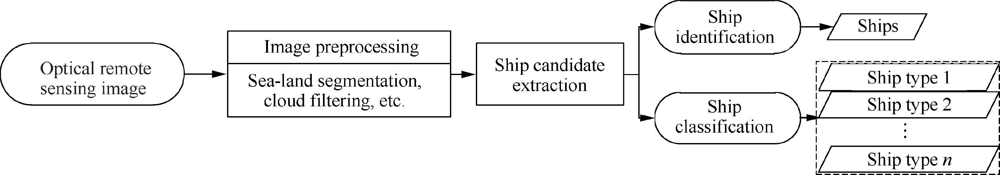{#fig-ship_workflow fig-align="center" width=60%}

Diante do exposto, a presente atividade objetivou testar a implementação de algoritmos de aprendizado de máquina no pré-processamento de imagens ópticas de satélite de ambientes marinhos com a presença de embarcações. Este teste de implementação, ao demonstrar potenciais de aprimoramentos e aplicação, trará algumas possibilidades de pré-processamento como (1) nas imagens que irão compor a base de dados para treinamento de algoritmos de aprendizado profundo e (2) no fluxo de trabalho do modelo entregue para a sua aplicação em problemas reais. Um dos problemas reais é a detecção de embarcações de pesca em Áreas Marinhas Protegidas para o controle, monitoramento e fiscalização da pesca ilegal, não regulamentada e não reportada [@welch2022_unseen_vessels; @welch2024_global_fishing_ai]. 

# Fundamentação teórica

A área da inteligência artificial tem o aprendizado de máquina como subárea. @russell_inteligencia_2013 enquadram oito conceituações de inteligência artificial em quatro abordagens. Duas dessas se relacionam ao raciocínio e as outras duas ao comportamento. As abordagens ainda são distinguidas entre aquelas cuja a inteligência humana será a referência para a comparação do desempenho de uma inteligência artificial e aquelas cuja a comparação será com a racionalidade enquanto referencial de inteligência ideal. Agentes racionais é a abordagem escolhida para a principal conceituação de inteligência artificial ao longo do livro. Por agentes, significa que está relacionada ao comportamento. Por racionais, à racionalidade. Racionalidade essa baseada em padrões matematicamente definidos o que permite a construção de modelos que não apenas compreendem o ambiente, mas também processam informações complexas. Sendo assim, a inteligência artificial pode ser definida por agentes racionais que agem para alcançar o melhor resultado possível ou esperado. Nessa perspectiva, o aprendizado de máquina será, portanto, agentes racionais aperfeiçoando seu comportamento através de suas próprias experiências [@russell_inteligencia_2013]. 

O aprendizado através da experiência está fortemente relacionado ao reconhecimento de padrões. @bishop_pattern_2006 comenta como o ato de reconhecer padrões acompanha a história da espécie humana e continua no momento em que tais descobertas se automatizaram por algoritmos computacionais. Dentro disso, o autor argumenta que melhores resultados podem ser obtidos através do aprendizado de máquina. Essa tecnologia utiliza algoritmos computacionais para a descoberta automática de regularidades em conjuntos de dados, aplicando esse conhecimento em regressões e classificações. O objetivo central é criar modelos capazes de generalizar suas ações para dados que não foram incluídos no treinamento inicial [@bishop_pattern_2006]. Para @russell_inteligencia_2013, a partir de uma coleção de pares de entrada e saída, o aprendizado de máquina permite se descobrir uma função que prevê a saída para novas entradas.

Existem três tipos ou *feedbacks* principais de aprendizagem de máquina: não supervisionado, supervisionado e por reforço. No aprendizado não supervisionado, o agente aprende padrões na entrada sem nenhum feedback explicitamente fornecido [@russell_inteligencia_2013]. Em outras palavras, o treinamento do algoritmo compreende dados de entrada sem qualquer dado de saída correspondente [@bishop_pattern_2006]. Um dos objetivos do aprendizado não supervisionado é agrupar dados similares e separar dados dissimilares. Exemplos de algoritmos incluem *K-Means*, *Affinity propagation*, *Mean-shift*, *Spectral clustering*, *Hierarquical clustering*, *Agglomerative clustering*, *DBSCAN*, *HDBSCAN*, *OPTICS*, *Gaussian mixtures* e *Bisecting K-means*, com os nomes em inglês mantidos conforme a documentação da biblioteca scikit-learn [@scikit-learn].

No aprendizado supervisionado, diferentemente, o conjunto de treinamento compreende os dados de entrada acompanhados dos dados de saída correspondentes, chamados de rótulos ou alvos [@bishop_pattern_2006]. Ou seja, o treinamento consiste em fornecer exemplos de pares de entrada e saída para que o algoritmo aprenda uma função que mapeie esse processamento [@russell_inteligencia_2013]. Quando a saída desejada for um conjunto finito de valores, tem-se um problema de classificação e quando for um número contínuo, tem-se um problema de regressão [@bishop_pattern_2006; @russell_inteligencia_2013]. Há diferentes abordagens de aprendizado supervisionado e cada uma inclui distintos algoritmos, por exemplo Modelos lineares, Máquinas de Vetores de Suporte, modelos baseados em Gradiente Descendente Estocástico, Vizinhos pŕoximos, Naive Bayes e Árvores de decisão [@scikit-learn].

O aprendizado por reforço funciona de uma forma particular. Ao invés de descobrir agrupamentos ou saídas ótimas como nos outros aprendizados, os algoritmos de aprendizado por reforço vão aprendendo as ações mais adequadas para determinado contexto conforme punições e recompensas. Ou seja, aprendem or um processo de tentativa e erro [@bishop_pattern_2006]. Algoritmos de aprendizado por reforço incluem *Q-Learning* e *SARSA* e já são considerados como aprendizado profundo [@zhang2023_dive_deep_learning].

# Metodologia

A presente atividade ocorreu em sincronia à etapa de coleta de dados para a construção da base de dados. A construção de uma base de dados faz parte do plano de trabalho do projeto de dissertação. Desta maneira, a construção da base de dados também fez parte da metodologia.

{#fig-rjadd02img86}

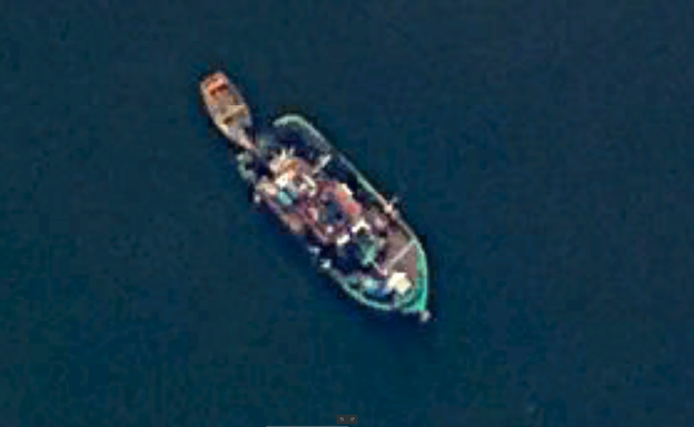{#fig-rjadd02img86_crop}

Hiperparâmetros DBSCAN e gráficos (exemplificar definição do eps)

Hiperparâmetros kNN e imagem dos dados de treino

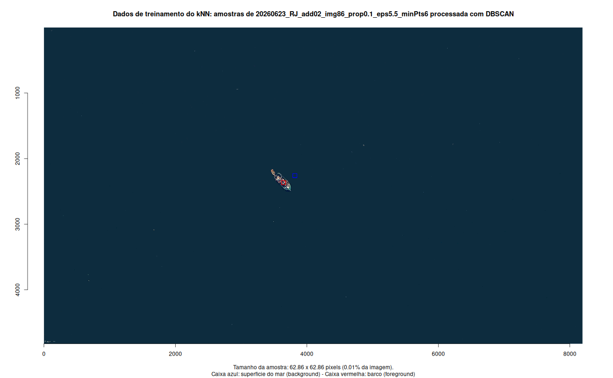{#fig-dadostreino_knn}

# Desenvolvimento

DBSCAN [@ester_density-based_1996] foi o algoritmo de aprendizado não supervisionado escolhido para o agrupamento de pixels R, G e B como forma de tratamento das imagens ópticas de satélite. kNN [@fix_discriminatory_1951; @cover_nearest_1967] foi o algoritmo de aprendizado supervisionado escolhido para a segmentação binária embarcação e superfície do mar a partir das imagens resultantes do tratamento. 

## DBSCAN 
DBSCAN é a abreviação de *Density Based Spatial Clustering of Applications with Noise* [@ester_density-based_1996]. Sua proposta buscou combinar três requisitos quais sejam a falta de conhecimento prévio para se determinar parâmetros de entrada, o agrupamento em formatos arbitrários e uma boa eficiência computacional. Até então, os principais algoritmos de agrupamento existentes eram baseados em partição ou em hierarquia. Ambos requerem conhecimentos prévios da base de dados seja para se determinar previamente o número de grupos representativos, no caso dos de partição, ou a condição de parada no caso dos hierárquicos. Ademais, ainda não havia algum algoritmo que possibilitasse agrupamentos não convexos ou não esféricos e que mantivesse os ruídos ou dados discrepantes (*outliers*) separados, sem forçá-los a pertencerem em algum grupo [@hahsler_dbscan_2019]. O DBSCAN, diferentemente dos algoritmos de agrupamento que funcionam por similaridade, funciona com uma proposta de agrupamento por densidade, o que permite o atendimento combinado dos requisitos mencionados acima. 

O DBSCAN foi desenvolvido com base em seis definições que vão encadeando os conceitos de *Eps-neighborhood*, *core points*, *border points*, *MinPts*, *directly density-reachable*, *density-reachable* e *density-connected* os quais podem ser visualizados nas @fig-dbscan_definitions. *Eps-neighborhood* compreende todos os dados que serão vizinhos de um dado central em determinado raio *eps*. De acordo com uma quantidade mínima de *MinPts* dentro de uma com a vizinhança de raio *eps*, cada dado é classificado em *core point* ou *border point*. Dados que atendem tais condições são *core points* enquanto que aqueles que não atendem são *border points*. Um *border point* será diretamente alcançável (*directly density-reachable*) se estiver na vizinhança de um *core point*. Há ainda a possibilidade de *border points* serem alcançáveis (*density-reachable*) se houver uma cadeia de pontos que partem de um *core point*. Ademais, *border points* podem ser conectados (*density-connected*) desde que ambos sejam alcançáveis por um *core point* [@ester_density-based_1996]. 

::: {#fig-dbscan_definitions layout-nrow="2"}

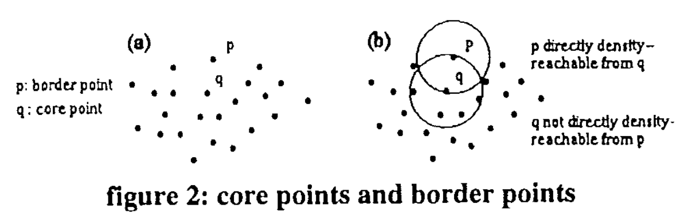{#fig-ester_fig2 fig-align="center" width=60%}

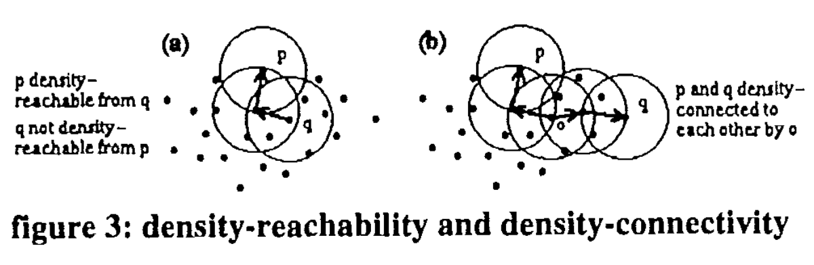{#fig-ester_fig3 fig-align="center" width=60%}

Ilustrações dos conceitos definidos durante o desenvolvimento do DBSCAN. Em (a) a figura 2 retirada do artigo ilustra os conceitos de *core points*, *border points* e *directly density-reachable*. Em (b) a figura 3 retirada do artigo ilustra os conceitos de *density-reachable* e *density-connected*. Retirado de @ester_density-based_1996.
:::

Tais conceitos são a base para a concepção de como os dados serão agrupados (*clusters*) e do que será considerado ruído (*noise*). Conforme @ester_density-based_1996 um agrupamento será formado com pontos que atendam às condições de maximalidade (*density-reachable*) e conectividade (*density-connected*) e ruídos (*noise*) serão pontos que ficaram de fora de qualquer agrupamento. Com isso, é possível pensar no DBSCAN modelando os dados de forma encadeada conforme as densidades presentes naqueles que atendem às condições de *core points* e que servem de ponto de partida para tal encadeamento. 

## kNN

kNN é a abreviação de *k-Nearest Neighboors* [@cover_nearest_1967]. Sua abordagem resolve problemas de classificação ou regressão com base na proximidade ao assumir que dados similares tendem a ser encontrados próximos uns dos outros. Em seu funcionamento, o algoritmo busca por uma quantidade pré-definida de dados rotulados (*neighboors*) de forma a utilizar essa proximidade para inputar uma classe ou um valor contínuo em dado desconhecido a depender do problema ser de classificação ou de regressão, respectivamente.

TODO acrescentar conteúdo do kNN (distâncias).

# Resultados

## Agrupamentos de valores de pixels R, G e B com DBSCAN

: Resultados dos testes de agrupamento por proporção de amostragem e parâmetros do DBSCAN. {#tbl-clusters}

|Teste|Amostra|Pixels|minPts|eps|Treino(s)|Predição(s)|Clusters|Ruído|
|------|--------|---------|------|---|--------|-----------|--------|--------|
|1|0.1|3951001|6|6.3|4.00|491.02|42|0.000833|
|2|0.2|7902003|6|4.5|9.78|515.23|36|0.001174|
|3|0.3|11853004|6|3.6|14.93|509.18|54|0.001746|
|4|0.1|3951001|6|7.3|4.45|556.49|16|0.000553|
|5|0.1|3951001|7|7.3|4.62|539.35|23|0.000569|
|6|0.1|3951001|6|8.3|4.95|585.41|7|0.000405|
|7|0.1|3951001|6|5.5|3.86|483.53|151|0.001349|
|8|0.1|3951001|6|5.7|3.91|513.23|94|0.001165|

### Teste 1 - amostra de 10%, *minPts* = 6 e *eps* = 6.3

{#fig-teste1}

{#fig-teste1_crop}

### Teste 2 - amostra de 20%, *minPts* = 6 e *eps* = 4.5

{#fig-teste2}

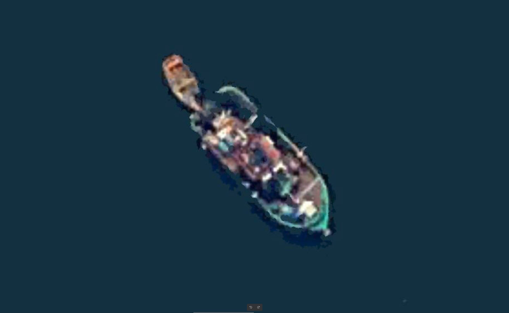{#fig-teste2_crop}

### Teste 3 - amostra de 30%, *minPts* = 6 e *eps* = 3.6

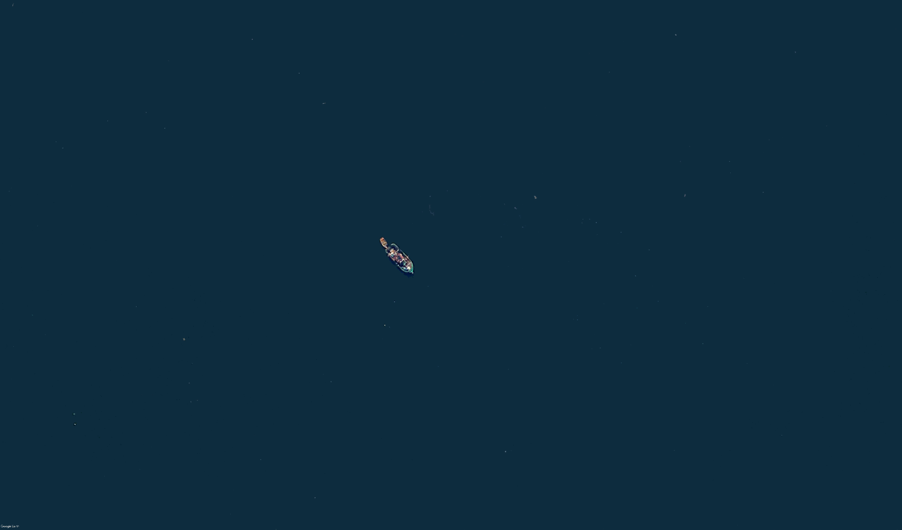{#fig-teste3}

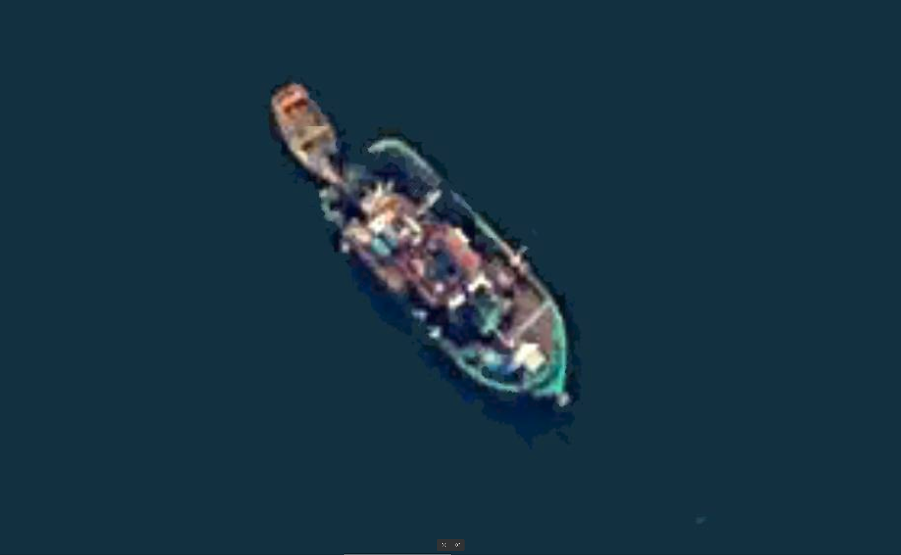{#fig-teste3_crop}

### Teste 4 - amostra de 10%, *minPts* = 6 e *eps* = 7.3

{#fig-teste4}

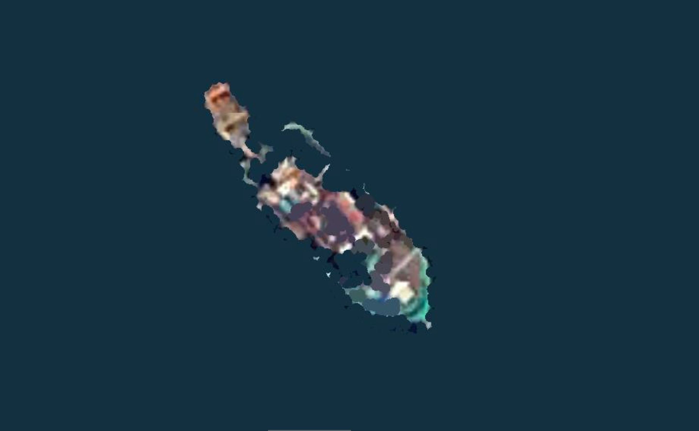{#fig-teste4_crop}

### Teste 5 - amostra de 10%, *minPts* = 7 e *eps* = 7.3

{#fig-teste5}

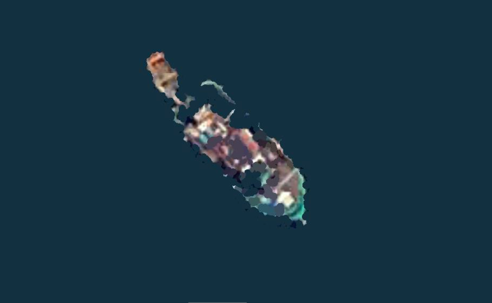{#fig-teste5_crop}

### Teste 6 - amostra de 10%, *minPts* = 6 e *eps* = 8.3

{#fig-teste6}

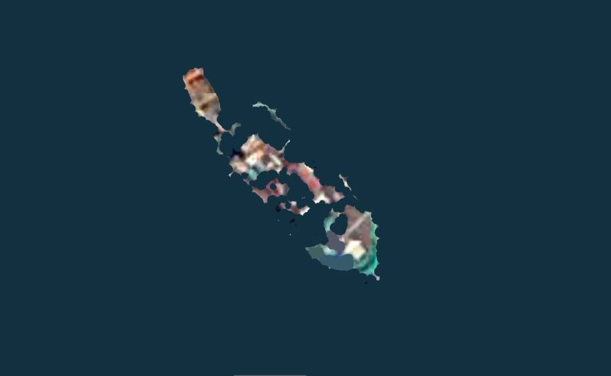{#fig-teste6_crop}

### Teste 7 - amostra de 10%, *minPts* = 6 e *eps* = 5.5

{#fig-teste7}

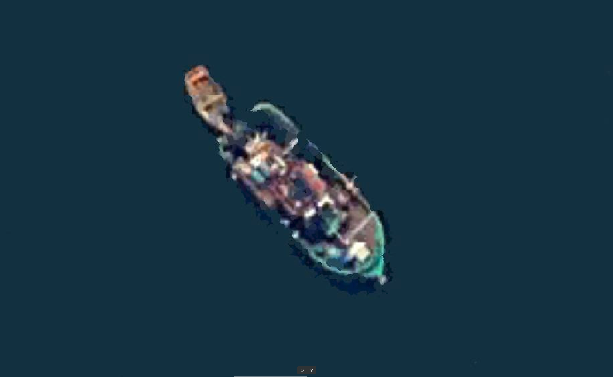{#fig-teste7_crop}

### Teste 8 - amostra de 10%, *minPts* = 6 e *eps* = 5.7

{#fig-teste8}

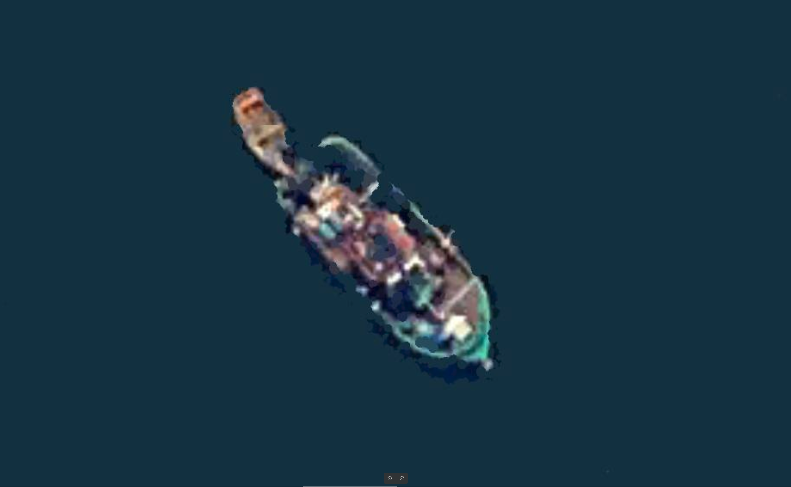{#fig-teste8_crop}

Imagem selecionada do teste 7 porque gerou mais clusters com menos ruídos 

## Segmentação binária embarcação e superfície do mar com kNN

kNN com a imagem original e com a imagem de melhor resultado com os testes com o DBSCAN.

### k = 6

::: {#fig-knn2 layout-ncol="2"}

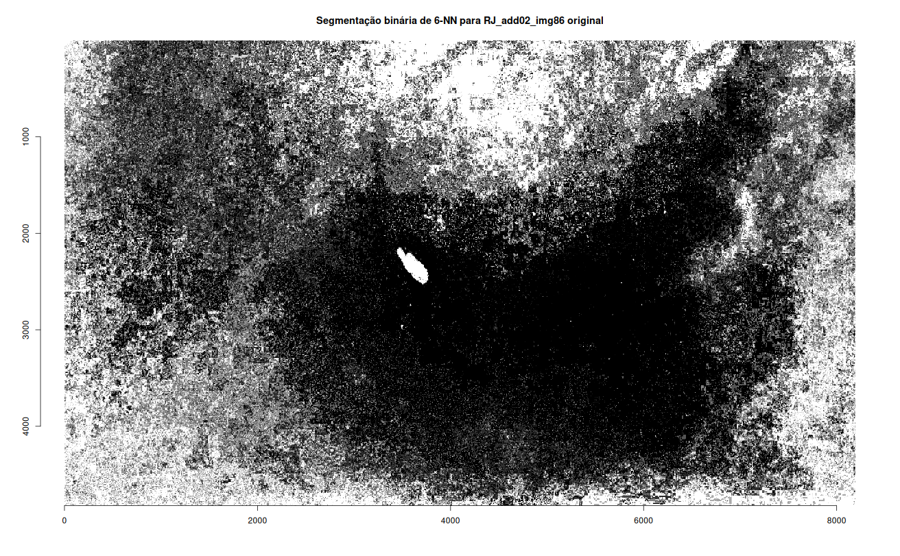{#fig-knn2_ori}

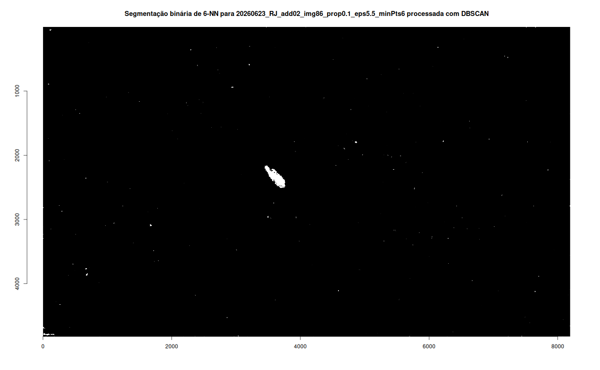{#fig-knn2_dbscan}

Legenda. Adaptado de: Google Earth Pro, 2026.
:::

### k = 5

::: {#fig-knn5 layout-ncol="2"}

{#fig-knn5_ori}

{#fig-knn5_dbscan}

Legenda. Adaptado de: Google Earth Pro, 2026.
:::

### k = 4

::: {#fig-knn4 layout-ncol="2"}

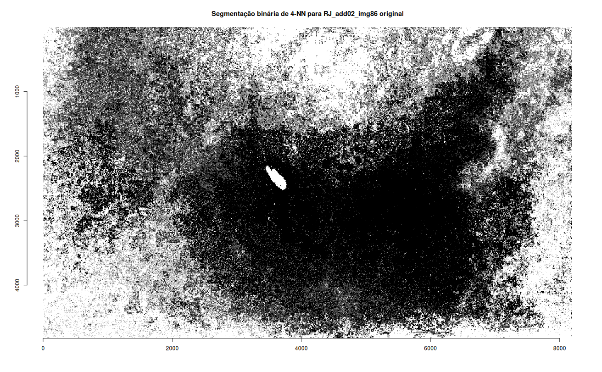{#fig-knn4_ori}

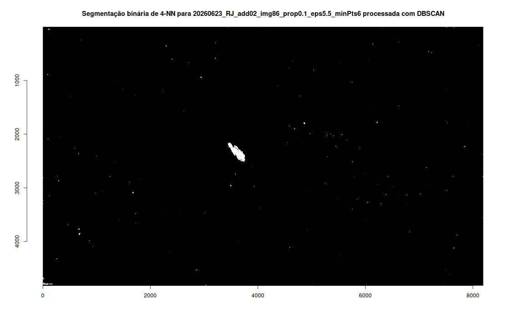{#fig-knn4_dbscan}

Legenda. Adaptado de: Google Earth Pro, 2026.
:::

### k = 3

::: {#fig-knn3 layout-ncol="2"}

{#fig-knn3_ori}

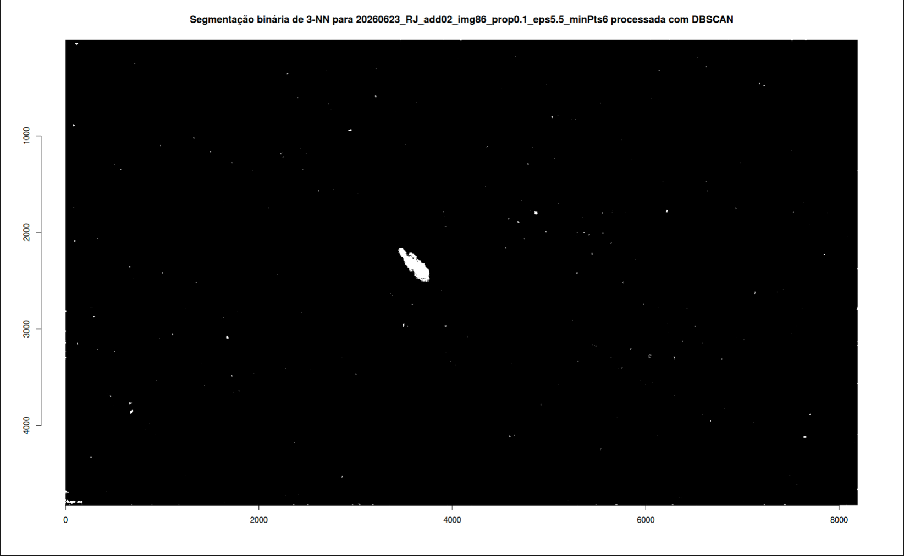{#fig-knn3_dbscan}

Legenda. Adaptado de: Google Earth Pro, 2026.
:::

### k = 2

::: {#fig-knn2 layout-ncol="2"}

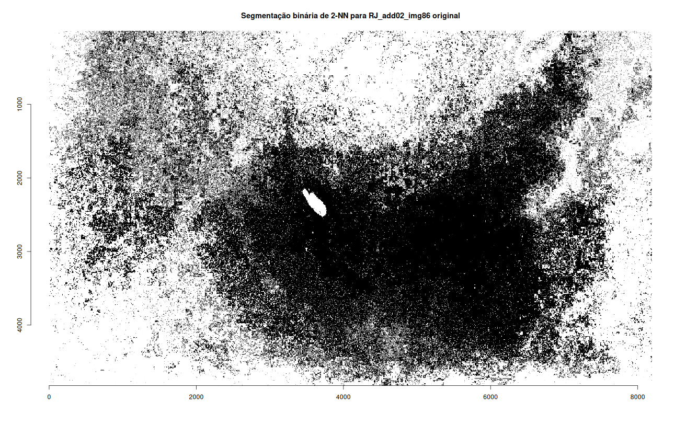{#fig-knn2_ori}

{#fig-knn2_dbscan}

Legenda. Adaptado de: Google Earth Pro, 2026.
:::

### Melhor kNN com blurr

TODO aplicar o blurr

# Discussão

TODO Explicar a escolha do melhor resultados dos testes com o DBSCAN.

Discussão crítica sobre limitações, vantagens e aplicações reais.

# Considerações finais e aprendizados obtidos

Considerações finais e aprendizados obtidos.

# Referências