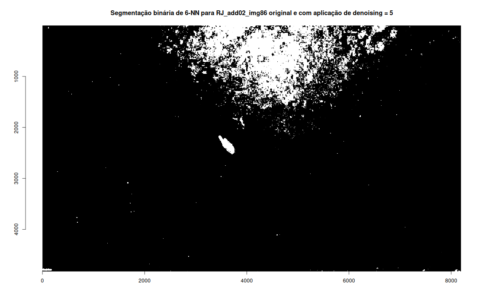
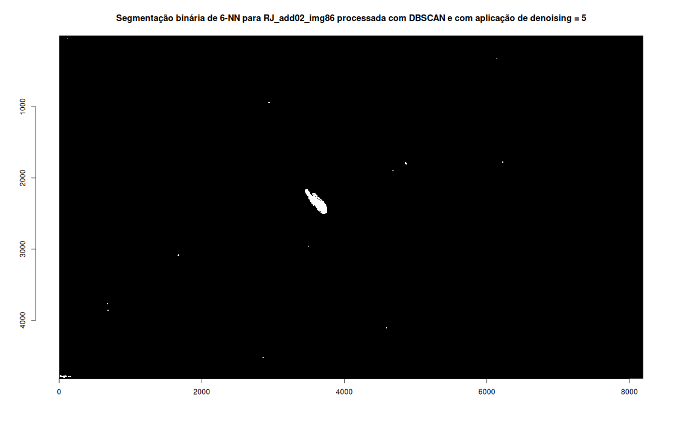

# Contextualização 

Imagens ópticas de satélite vêm sendo amplamente utilizadas em visão computacional para a detecção de embarcações com algoritmos de aprendizado de máquina. Os principais motivos residem na facilidade de interpretação, na riqueza de dados com diferentes bandas e resoluções espectrais, nos níveis de detalhes os quais podem chegar na escala submétrica através das altas resoluções espaciais, além da maior disponibilidade de imagens quando comparadas às de radar. Esse aumento tem sido influenciado pelo crescente lançamento e modernização de satélites de imageamento [@zhao2024_ship_detection_advances]. Desta maneira, a literatura científica, atualmente, fornece não apenas uma vasta gama de algoritmos especificamente desenvolvidos para a detecção de embarcações como igualmente diversas bases de treinamentos compostas por imagens ópticas de satélite com a presença barcos [@er_ship_2023; @zhang_development_2024].

Entretanto, dada a sua complexidade, o imageamento de ambientes marinhos apresenta uma série de desvantagens. Imagens ópticas de satélite dependem de condições ambientais favoráveis e da luminosidade natural já que são dados gerados por sensores passivos. Os ambientes marinhos são considerados fisicamente complexos com uma dinâmica intensa de neblina, nuvens, sombras e ondulações as quais podem dificultar a reflexão ideal das ondas eletromagnéticas a serem recebidas pelos sensores [@zhao2024_ship_detection_advances]. Por isso, os requisitos dos sensores satelitais ópticos muitas vezes não são plenamente atendidos durante um imageamento e a qualidade das imagens resultantes nem sempre será a ideal (@fig-COR03_img05). Portanto, técnicas de pré-processamento podem ser aplicadas para melhorar a qualidade das imagens na construção de bases de dados impactando positivamente no desempenho dos algoritmos [@teixeira_literature_2022].

{#fig-COR03_img05 fig-align="center" width=60%}

A detecção de embarcações ainda é desafiadora devido às características particulares destes tipos de objetos. Há uma ampla diversidade de veículos marítimos para diferentes fins, abrangendo desde navios militares, turísticos e recreativos até aqueles comerciais como os de pesca. Além dessa diversidade interclasse, há ainda uma diversidade intraclasse cujos barcos para o mesmo fim variam em suas engenharias, apresentando diferentes formatos, cores, comprimentos, larguras e composição de materiais [@zhang_shiprsimagenet_2021]. Atendo-se às embarcações pesqueiras no Brasil, por exemplo, parte-se de uma heterogeneidade entre aquelas industriais e artesanais, comprimentos podem variar de 2 a 30 metros, barcos do mesmo tipo podem ter formatos distintos entre as regiões brasileiras, além das diferentes modalidades de pesca as quais consistem em diferentes petrechos [@oliveira_catalogo_2020]. Exemplo disso são os barcos de arrasto, de cerco, de vara e isca viva e de espinhel. Tal diversidade pode ser observada na @fig-NITE02_img34_meta. Consequentemente, a qualidade das imagens é uma fator determinante para uma efetiva detecção de embarcações em visão computacional, sobretudo se há pretensões de classificações em níveis mais finos.

{#fig-NITE02_img34_meta fig-align="center" width=60%}

Para lidar com os problemas já mencionados na detecção de embarcações, operações de pré-processamento como a redução de interferências ambientais e a segmentação são comumente aplicadas [@kanjir_vessel_2018; @li_ship_2021]. Conforme @bishop_pattern_2006, o pré-processamento consiste em transformações nas variáveis de entrada resultando em um novo espaço de variáveis com o intuito de aumentar o desempenho e otimizar o processamento computacional. Sendo assim, essa é uma das principais etapas nos fluxos de trabalho para a detecção de embarcações com aprendizado de máquina utilizando imagens ópticas de satélite como dados de entrada (@fig-ship_workflow). 

{#fig-ship_workflow fig-align="center" width=60%}

Diante do exposto, a presente atividade objetivou testar a implementação de algoritmos de aprendizado de máquina no pré-processamento de imagens ópticas de satélite de ambientes marinhos com a presença de embarcações. Este teste de implementação, ao demonstrar potenciais de aprimoramentos e aplicação, trará algumas possibilidades de pré-processamento como (1) nas imagens que irão compor a base de dados para treinamento de algoritmos de aprendizado profundo e (2) no fluxo de trabalho do modelo entregue para a sua aplicação em problemas reais. Um dos problemas reais é a detecção de embarcações de pesca em Áreas Marinhas Protegidas para o controle, monitoramento e fiscalização da pesca ilegal, não regulamentada e não reportada [@welch2022_unseen_vessels; @welch2024_global_fishing_ai]. 

# Fundamentação teórica

A área da inteligência artificial tem o aprendizado de máquina como subárea. @russell_inteligencia_2013 enquadram oito conceituações de inteligência artificial em quatro abordagens. Duas dessas se relacionam ao raciocínio e as outras duas ao comportamento. As abordagens ainda são distinguidas entre aquelas cuja a inteligência humana será a referência para a comparação do desempenho de uma inteligência artificial e aquelas cuja a comparação será com a racionalidade enquanto referencial de inteligência ideal. Agentes racionais é a abordagem escolhida para a principal conceituação de inteligência artificial ao longo do livro. Por agentes, significa que está relacionada ao comportamento. Por racionais, à racionalidade. Racionalidade essa baseada em padrões matematicamente definidos o que permite a construção de modelos que não apenas compreendem o ambiente, mas também processam informações complexas. Sendo assim, a inteligência artificial pode ser definida por agentes racionais que agem para alcançar o melhor resultado possível ou esperado. Nessa perspectiva, o aprendizado de máquina será, portanto, agentes racionais aperfeiçoando seu comportamento através de suas próprias experiências [@russell_inteligencia_2013]. 

O aprendizado através da experiência está fortemente relacionado ao reconhecimento de padrões. @bishop_pattern_2006 comenta como o ato de reconhecer padrões acompanha a história da espécie humana e continua no momento em que tais descobertas se automatizaram por algoritmos computacionais. Dentro disso, o autor argumenta que melhores resultados podem ser obtidos através do aprendizado de máquina. Essa tecnologia utiliza algoritmos computacionais para a descoberta automática de regularidades em conjuntos de dados, aplicando esse conhecimento em regressões e classificações. O objetivo central é criar modelos capazes de generalizar suas ações para dados que não foram incluídos no treinamento inicial [@bishop_pattern_2006]. Para @russell_inteligencia_2013, a partir de uma coleção de pares de entrada e saída, o aprendizado de máquina permite a descoberta de uma função que prevê a saída para novas entradas.

Existem três tipos ou *feedbacks* principais de aprendizagem de máquina: não supervisionado, supervisionado e por reforço. No aprendizado não supervisionado, o agente aprende padrões na entrada sem nenhum *feedback* explicitamente fornecido [@russell_inteligencia_2013]. Em outras palavras, o treinamento do algoritmo compreende dados de entrada sem qualquer dado de saída correspondente [@bishop_pattern_2006]. Um dos objetivos do aprendizado não supervisionado é agrupar dados similares e separar dados dissimilares. Exemplos de algoritmos incluem *K-Means*, *Affinity propagation*, *Mean-shift*, *Spectral clustering*, *Hierarquical clustering*, *Agglomerative clustering*, *DBSCAN*, *HDBSCAN*, *OPTICS*, *Gaussian mixtures* e *Bisecting K-means*, com os nomes em inglês mantidos conforme a documentação da biblioteca scikit-learn [@scikit-learn].

No aprendizado supervisionado, diferentemente, o conjunto de treinamento compreende os dados de entrada acompanhados dos dados de saída correspondentes, chamados de rótulos ou alvos [@bishop_pattern_2006]. Ou seja, o treinamento consiste em fornecer exemplos de pares de entrada e saída para que o algoritmo aprenda uma função que mapeie esse processamento [@russell_inteligencia_2013]. Quando a saída desejada for um conjunto finito de valores, tem-se um problema de classificação e quando for um número contínuo, tem-se um problema de regressão [@bishop_pattern_2006; @russell_inteligencia_2013]. Há diferentes abordagens de aprendizado supervisionado e cada uma inclui distintos algoritmos, por exemplo Modelos lineares, Máquinas de Vetores de Suporte, modelos baseados em Gradiente Descendente Estocástico, Vizinhos pŕoximos, Naive Bayes e Árvores de decisão [@scikit-learn].

O aprendizado por reforço funciona de uma forma particular. Ao invés de descobrir agrupamentos ou saídas ótimas como nos outros aprendizados, os algoritmos de aprendizado por reforço vão aprendendo as ações mais adequadas para determinado contexto conforme punições e recompensas. Ou seja, aprendem por um processo de tentativa e erro [@bishop_pattern_2006]. Algoritmos de aprendizado por reforço incluem *Q-Learning* e *SARSA* e já são considerados como aprendizado profundo [@zhang2023_dive_deep_learning].

# Metodologia

A presente atividade ocorreu durante a etapa de coleta de dados para a construção da base de dados prevista no plano de trabalho do projeto de dissertação de mestrado. O Google Earth Pro [@googleearth2026] é apontado como a principal fonte de dados na construção de bases de treinamento para a detecção de embarcações [@zhang_development_2024]. Com base nos portos pesqueiros georreferenciados no Programa Nacional de Regularização de Embarcação de Pesca (PROPESC) [@mpa_propesc], 2670 imagens de satélite foram extraídas do Google Earth Pro. Uma imagem foi selecionada de forma aleatória para a realização da presente atividade e pode ser visualizada nas @fig-rjadd02img86 e @fig-rjadd02img86_crop.

{#fig-rjadd02img86}

{#fig-rjadd02img86_crop}

O R [@r_core_team_r_2026] e o Positron [@posit_team_positron_2026] foram a linguagem de programação e o ambiente de desenvolvimento integrado utilizados, respectivamente. DBSCAN [@ester_density-based_1996] foi o algoritmo de aprendizado não supervisionado escolhido para o agrupamento de pixels R, G e B como forma de tratamento das imagens ópticas de satélite. kNN [@fix_discriminatory_1951; @cover_nearest_1967] foi o algoritmo de aprendizado supervisionado escolhido para a segmentação binária entre embarcação e superfície do mar a partir das imagens resultantes do tratamento com o DBSCAN. Para a implementação, utilizou-se os pacotes imager [@imager], dplyr [@dplyr], tidyr [@tidyr], dbscan [@hahsler_dbscan_2019] e nabor [@elsebergcomparison].

A imagem foi importada no Positron e convertida de objeto *cimg* para matrizes numéricas baseadas no R, G e B por pixel. Pode-se observar que a imagem, em seu estado original, tem largura vs. altura de 8.192 x 4.823 pixels, profundidade 1 e os 3 canais de cores já mencionados. A matriz gerada, por sua vez, é composta por 39.510.016 observações de 5 variáveis sendo elas as coordenadas x e y de cada pixel, do tipo inteiro, bem como os valores R, G e B do tipo numérico também para cada pixel. Os dados da imagem importada e do *data frame*, retirados do *pipeline* de desenvolvimento, são apresentados a seguir e trazem essas informações.

Dados da imagem importada:
```
Image. Width: 8192 pix Height: 4823 pix Depth: 1 Colour channels: 3 
```  

Dados do *data frame* gerado:
```
'data.frame':	39510016 obs. of  5 variables:
 $ x: int  1 2 3 4 5 6 7 8 9 10 ...
 $ y: int  1 1 1 1 1 1 1 1 1 1 ...
 $ R: num  0.102 0.098 0.098 0.0941 0.098 ...
 $ G: num  0.165 0.161 0.161 0.157 0.161 ...
 $ B: num  0.227 0.224 0.224 0.22 0.224 ...
```

A partir de uma análise exploratória dos dados, foi possível constatar que os valores R, G e B estão escalonados entre 0 e 1, sendo 0 para ausência de saturação e 1 para a máxima saturação em cada canal de cor. Para todos os canais predominam valores mais próximos de 0 do que de 1, indicando uma imagem com menos luminosidade ou reflectância [@imager]. O canal R é o que possui os valores mais baixos quando comparado aos outros canais G e B, indicando maior absorção de comprimentos de onda na região do vermelho assim como uma maior reflexão de comprimentos de onda na região do verde e do azul, sendo esse último ainda maior, algo esperado pelo fato da imagem ser de ambiente marinho com predominância da superfície do mar. O sumário estatístico do *data frame*, retirado do *pipeline* de desenvolvimento, traz essas informações.

```
       x              y              R                 G                B         
 Min.   :   1   Min.   :   1   Min.   :0.00000   Min.   :0.0000   Min.   :0.0000  
 1st Qu.:2049   1st Qu.:1206   1st Qu.:0.02353   1st Qu.:0.1686   1st Qu.:0.2275  
 Median :4096   Median :2412   Median :0.05490   Median :0.1725   Median :0.2471  
 Mean   :4096   Mean   :2412   Mean   :0.05110   Mean   :0.1746   Mean   :0.2449  
 3rd Qu.:6144   3rd Qu.:3618   3rd Qu.:0.07843   3rd Qu.:0.1804   3rd Qu.:0.2588  
 Max.   :8192   Max.   :4823   Max.   :1.00000   Max.   :1.0000   Max.   :1.0000  
```

### DBSCAN

Com o *data frame* gerado, realizou-se diferentes testes variando o tamanho amostral e os hiperparâmetros do DBSCAN. Após a definição do tamanho amostral, realizou-se uma amostragem aleatória simples de pixels sem reposição. A amostra foi normalizada com base no método de *escore-Z* tornando a distribuição dos dados normal com média 0 e desvio padrão 1. Em seguida, utilizou-se a recomendação de @hahsler_dbscan_2019 para a definição inicial do parâmetro *minPts* e a recomendação de @ester_density-based_1996 para a definição inicial do parâmetro *eps* a qual se baseia no método de *elbow*. O tempo de treinamento e de predição foram registrados em segundos. Cada teste resultou em um gráfico para a definição do parâmetro *eps*, um gráfico dos grupos (*clusters*) e um relatório contendo as definições citadas acima, juntamente com a proporção de ruído (*noise*).

Para a geração da imagem, inicialmente se calculou os valores médios de R, G e B por grupos (*clusters*), excluídos os ruídos (*noise*). Cada pixel teve seus valores R, G e B substituídos pelo R, G, B médio do seu grupo (*clusters*) e os ruídos mantiveram os valores originais. Com isso, a matriz de pixels foi convertida de objeto *data frame* para objeto *cimg*, representando uma imagem. 

### kNN

Dos testes realizados com o DBSCAN, analisou-se qual deles demonstravam o balanço mais interessante entre todos os critérios de análise como tempo de teste e de predição, quantidade de grupos (*clusters*) e proporção de ruído (*noise*), além do aspecto visual. O teste que apresentou os melgores resultados teve sua imagem selecionada para a segmentação com o kNN, o que envolveu a extração de amostras de pixels da imagem para a geração de dados de treinamento. Inicialmente, escolheu-se uma proporção de 10% para os dados de treinamento de cada classe. A classe embarcação recebeu máscara 1 enquanto que a classe superfície do mar recebeu máscara 0. A área extraída de regiões da imagem obedeceu essa proporçãopara cada classe e é ilustrada na @fig-dadostreino_knn.  

{#fig-dadostreino_knn}

 Testes foram realizados com diferentes valores de *k* tanto para a imagem original, sem o tratamento com o DBSCAN, quanto para a imagem tratada. Como resultados, foram obtidas imagens segmentadas as quais foram visualmente analisadas para comparação do efeito do DBSCAN no agrupamento dos pixels e na separação entre embarcação e superfície do mar.  

# Desenvolvimento

## DBSCAN 
DBSCAN é a abreviação de *Density Based Spatial Clustering of Applications with Noise* [@ester_density-based_1996]. Sua proposta buscou combinar três requisitos quais sejam a falta de conhecimento prévio para se determinar parâmetros de entrada, o agrupamento em formatos arbitrários e uma boa eficiência computacional para bases de dados espaciais de larga escala. Até então, os principais algoritmos de agrupamento existentes eram baseados em partição ou em hierarquia. Ambos requerem conhecimentos prévios da base de dados seja para se determinar previamente o número de grupos representativos, no caso dos de partição, ou a condição de parada no caso dos hierárquicos. Ademais, ainda não havia algum algoritmo que possibilitasse agrupamentos não convexos ou não esféricos e que mantivesse os ruídos ou dados discrepantes (*outliers*) separados, sem forçá-los a pertencerem em algum grupo [@hahsler_dbscan_2019]. O DBSCAN, diferentemente dos algoritmos de agrupamento que funcionam por similaridade, funciona com uma proposta de agrupamento por densidade, o que permite o atendimento combinado dos requisitos mencionados acima. 

O DBSCAN foi desenvolvido com base em seis definições que vão encadeando os conceitos de *Eps-neighborhood*, *core points*, *border points*, *minPts*, *directly density-reachable*, *density-reachable* e *density-connected* os quais podem ser visualizados nas @fig-dbscan_definitions. *Eps-neighborhood* compreende todos os dados que serão vizinhos de um dado central em determinado raio *eps*. De acordo com uma quantidade mínima de *minPts* dentro de uma vizinhança de raio *eps*, cada dado é classificado em *core point* ou *border point*. Dados que atendem tais condições são *core points* enquanto que aqueles que não atendem são *border points*. Um *border point* será diretamente alcançável (*directly density-reachable*) se estiver na vizinhança de um *core point*. Há ainda a possibilidade de *border points* serem alcançáveis (*density-reachable*) se houver uma cadeia de pontos que partem de um *core point*. Ademais, *border points* podem ser conectados (*density-connected*) desde que ambos sejam alcançáveis por um *core point* [@ester_density-based_1996]. 

::: {#fig-dbscan_definitions layout-nrow="2"}

{#fig-ester_fig2 fig-align="center" width=60%}

{#fig-ester_fig3 fig-align="center" width=60%}

Ilustrações dos conceitos definidos durante o desenvolvimento do DBSCAN. Em (a) a figura 2 retirada do artigo ilustra os conceitos de *core points*, *border points* e *directly density-reachable*. Em (b) a figura 3 retirada do artigo ilustra os conceitos de *density-reachable* e *density-connected*. Retirado de @ester_density-based_1996.
:::

Tais conceitos são a base para a concepção de como os dados serão agrupados em grupos (*clusters*) e do que será considerado ruído (*noise*). Conforme @ester_density-based_1996 um agrupamento será formado com pontos que atendam às condições de maximalidade (*density-reachable*) e conectividade (*density-connected*) e ruídos (*noise*) serão pontos que ficaram fora de qualquer agrupamento. Com isso, é possível pensar no DBSCAN modelando os dados de forma encadeada conforme as densidades presentes naqueles que atendem às condições de *core points* e que servem de ponto de partida para tal encadeamento. 

## kNN

kNN é a abreviação de *k-Nearest Neighboors* [@cover_nearest_1967]. Sua abordagem resolve problemas de classificação ou regressão com base na proximidade ao assumir que dados similares tendem a ser encontrados próximos uns dos outros. Em seu funcionamento, o algoritmo busca por uma quantidade pré-definida de dados rotulados (*neighboors*) de forma a utilizar essa proximidade para inputar uma classe ou um valor contínuo em dado desconhecido a depender do problema ser de classificação ou de regressão, respectivamente.

# Resultados

## Agrupamentos de valores de pixels R, G e B com DBSCAN

A @tbl-clusters apresenta os resultados para os diferentes testes de agrupamentos de valores de pixels R, G e B realizados com o DBSCAN. Foram realizados 8 testes variando entre tamanhos amostrais e definição dos hiperparâmetros *eps* e *minPts*. 

: Resultados dos testes de agrupamento de valores de pixels R, G e B com DBSCAN. Amostra é a proporção de pixels sorteados aleatoriamente da imagem original. Pixels é a quantidade de pixels da amostra. *minPts* e *eps* são os hiperparâmetros do algoritmo. Treino e Predição contabilizam o tempo de processamento em segundos. Clusters são a quantidade de agrupamentos formados. Ruído é a proporção de dados que ficaram de fora de qualquer agrupamento. {#tbl-clusters}

|Teste|Amostra|Pixels|minPts|eps|Treino(s)|Predição(s)|Clusters|Ruído|
|------|--------|---------|------|---|--------|-----------|--------|--------|
|1|0.1|3951001|6|6.3|4.00|491.02|42|0.000833|
|2|0.2|7902003|6|4.5|9.78|515.23|36|0.001174|
|3|0.3|11853004|6|3.6|14.93|509.18|54|0.001746|
|4|0.1|3951001|6|7.3|4.45|556.49|16|0.000553|
|5|0.1|3951001|7|7.3|4.62|539.35|23|0.000569|
|6|0.1|3951001|6|8.3|4.95|585.41|7|0.000405|
|7|0.1|3951001|6|5.5|3.86|483.53|151|0.001349|
|8|0.1|3951001|6|5.7|3.91|513.23|94|0.001165|

Os resultados de cada teste são apresentados na sequência e compreendem a imagem inteira resultante do agrupamento, a imagem recortada com ampliação da área com embarcação, o gráfico gerado a partir da definição do *minPts* e utilizado para a definição do *eps* bem como o gráfico dos grupos (*clusters*) resultantes. O ruído (*noise*) foi mantido na visualização e aparece indexado por zero. Para uma melhor visualização dos resultados, optou-se por tamanhos de imagens ocupando o espaço inteiro da página.

### Teste 1 - amostra de 10%, *minPts* = 6 e *eps* = 6.3
{#fig-teste1}

{#fig-teste1_crop}


### Teste 2 - amostra de 20%, *minPts* = 6 e *eps* = 4.5
{#fig-teste2}

{#fig-teste2_crop}


### Teste 3 - amostra de 30%, *minPts* = 6 e *eps* = 3.6
{#fig-teste3}

{#fig-teste3_crop}


### Teste 4 - amostra de 10%, *minPts* = 6 e *eps* = 7.3
{#fig-teste4}

{#fig-teste4_crop}


### Teste 5 - amostra de 10%, *minPts* = 7 e *eps* = 7.3
{#fig-teste5}

{#fig-teste5_crop}


### Teste 6 - amostra de 10%, *minPts* = 6 e *eps* = 8.3
{#fig-teste6}

{#fig-teste6_crop}


### Teste 7 - amostra de 10%, *minPts* = 6 e *eps* = 5.5
{#fig-teste7}

{#fig-teste7_crop}


### Teste 8 - amostra de 10%, *minPts* = 6 e *eps* = 5.7
{#fig-teste8}

{#fig-teste8_crop}

## Segmentação binária embarcação e superfície do mar com kNN

### k = 6
::: {#fig-knn6 layout-ncol="2"}

{#fig-knn6_ori}

{#fig-knn6_dbscan}

Segmentação binária embarcação e superfície do mar com 6-NN. Em (a) o teste com a imagem original e em (b) o teste com a imagem tratada com DBSCAN. Adaptado de: Google Earth Pro, 2026.
:::

### k = 5
::: {#fig-knn5 layout-ncol="2"}

{#fig-knn5_ori}

{#fig-knn5_dbscan}

Segmentação binária embarcação e superfície do mar com 5-NN. Em (a) o teste com a imagem original e em (b) o teste com a imagem tratada com DBSCAN. Adaptado de: Google Earth Pro, 2026.
:::

### k = 4
::: {#fig-knn4 layout-ncol="2"}

{#fig-knn4_ori}

{#fig-knn4_dbscan}

Segmentação binária embarcação e superfície do mar com 4-NN. Em (a) o teste com a imagem original e em (b) o teste com a imagem tratada com DBSCAN. Adaptado de: Google Earth Pro, 2026.
:::

### k = 3
::: {#fig-knn3 layout-ncol="2"}

{#fig-knn3_ori}

{#fig-knn3_dbscan}

Segmentação binária embarcação e superfície do mar com 3-NN. Em (a) o teste com a imagem original e em (b) o teste com a imagem tratada com DBSCAN. Adaptado de: Google Earth Pro, 2026.
:::

### k = 2
::: {#fig-knn2 layout-ncol="2"}

{#fig-knn2_ori}

{#fig-knn2_dbscan}

Segmentação binária embarcação e superfície do mar com 2-NN. Em (a) o teste com a imagem original e em (b) o teste com a imagem tratada com DBSCAN. Adaptado de: Google Earth Pro, 2026.
:::

### 6-NN com aplicação prévia de *denoising*

::: {#fig-knn6_denoised5 layout-ncol="2"}

{#fig-knn6_denoised5_ori}

{#knn6_denoised5_dbscan}

Segmentação binária embarcação e superfície do mar com 6-NN e com prévia aplicação de *denoising*. Em (a) o teste com a imagem original e em (b) o teste com a imagem tratada com DBSCAN. Adaptado de: Google Earth Pro, 2026.
:::

# Discussão

Os resultados obtidos evidenciam tanto o potencial quanto os desafios de se aplicar algoritmos de aprendizado de máquina não supervisionado e supervisionado como etapas de pré-processamento na detecção de embarcações em imagens ópticas de satélite.

No que se refere ao DBSCAN, os oito testes realizados confirmaram a sensibilidade do algoritmo aos hiperparâmetros *eps* e *minPts*, conforme já esperado a partir de sua fundamentação teórica [@ester_density-based_1996; @hahsler_dbscan_2019]. Há uma relação inversa entre o valor de *eps* e o número de grupos (*clusters*) resultantes. Isso ficou evidente ao se comparar os testes com amostra fixa de 10%: valores maiores de *eps* (7.3 e 8.3) resultaram em agrupamentos mais amplos e, consequentemente, em menos grupos (16 e 7, respectivamente) e menor proporção de ruído, enquanto valores menores (5.5 e 5.7) fragmentaram os dados em um número consideravelmente maior de agrupamentos (151 e 94). Esse comportamento é coerente com a lógica de agrupamento por densidade descrita por @ester_density-based_1996, na qual um raio de vizinhança mais amplo tende a conectar regiões de densidade distintas em um único agrupamento.

Ao se observar a @tbl-clusters, nota-se que o teste 6 apresentou proporção de ruído menor (0,000405) que o teste 7 (0,001349), mas com apenas 7 grupos — um nível de agrupamento provavelmente insuficiente para capturar a heterogeneidade de tons presentes na imagem (água, sombra, casco, convés, petrechos). Isso sugere que o critério de seleção adotado não foi puramente quantitativo, mas sim uma ponderação qualitativa entre granularidade de agrupamento e limpeza dos dados — decisão coerente com a natureza exploratória da atividade, mas que aponta para a necessidade de métricas mais formais de avaliação de agrupamento (como o índice de Silhueta ou o Density-Based Clustering Validation - DBCV) em etapas futuras do projeto, de modo a tornar a seleção do agrupamento ideal menos dependente de inspeção visual.

Outro aspecto relevante foi o custo computacional do DBSCAN. Enquanto o tempo de treinamento cresceu de forma esperada com o aumento do tamanho amostral (de aproximadamente 4s para 15s entre os testes com 10% e 30% da imagem), o tempo de predição manteve-se consistentemente elevado (entre 480 e 585 segundos) independentemente do tamanho da amostra utilizada no treinamento, já que a predição foi aplicada sobre a totalidade dos pixels da imagem original. Esse comportamento reforça uma das limitações práticas do DBSCAN discutidas por @ester_density-based_1996 e @hahsler_dbscan_2019 quanto à sua escalabilidade em bases de dados de grande volume, o que é particularmente relevante ao se considerar que a presente atividade utilizou uma única imagem de aproximadamente 39,5 milhões de pixels, enquanto a base de dados completa do projeto de dissertação compreende 2670 imagens. Isso levanta uma questão prática importante para as próximas etapas do trabalho: a viabilidade computacional de aplicar o DBSCAN como pré-processamento em escala, o que pode exigir estratégias como paralelização, redução amostral mais agressiva ou algoritmos aproximados de vizinhança (como o utilizado no pacote nabor, já empregado no pipeline atual).

Em relação à segmentação com o kNN, os resultados indicam que o valor de k = 6 produziu a separação visualmente mais satisfatória entre embarcação e superfície do mar, tanto na imagem original quanto na tratada com DBSCAN. Esse resultado é consistente com a proposição teórica do algoritmo [@fix_discriminatory_1951; @cover_nearest_1967], segundo a qual valores de k muito baixos tendem a produzir classificações mais sensíveis a ruído local. A comparação entre a segmentação da imagem original e da imagem tratada com DBSCAN é o ponto mais relevante para o objetivo central da atividade: ela permite avaliar empiricamente se o agrupamento prévio por densidade de fato contribui para uma segmentação mais nítida e menos ruidosa entre embarcação e mar, o que motivou a proposta de utilizar o DBSCAN como etapa de pré-processamento e que dialoga diretamente com a literatura sobre a importância do pré-processamento no desempenho de algoritmos de detecção de embarcações [@bishop_pattern_2006; @teixeira_literature_2022; @li_ship_2021]. A inclusão do teste com denoising prévio (blurring = 5) para k = 6 também caminha nessa direção, sugerindo uma tentativa de isolar o efeito da suavização de ruído independentemente do agrupamento por densidade.

Cabe destacar algumas limitações da presente atividade. Primeiramente, os testes foram conduzidos sobre uma única imagem selecionada aleatoriamente, o que impede qualquer generalização estatística sobre o desempenho do DBSCAN e do kNN para o conjunto completo de 2670 imagens da base de dados — imagens que, como discutido na contextualização, podem variar substancialmente quanto à luminosidade, presença de nuvens, sombras e diversidade de embarcações. Em segundo lugar, a seleção dos parâmetros ótimos de ambos os algoritmos baseou-se predominantemente em inspeção visual e em critérios qualitativos, o que, embora adequado para uma etapa exploratória, não substitui métricas quantitativas de validação de agrupamento e classificação (como acurácia, F1-score ou índice de Jaccard) que deverão ser incorporadas em etapas futuras, especialmente diante da existência de rótulos de referência (a máscara binária embarcação e superfície do mar).

Apesar dessas limitações, os resultados obtidos reforçam a viabilidade de se utilizar o DBSCAN como uma etapa intermediária de tratamento de imagens ópticas de satélite antes da segmentação supervisionada, contribuindo para os dois usos pretendidos apontados na contextualização: (1) o aprimoramento de imagens que comporão a base de treinamento de modelos de aprendizado profundo para detecção de embarcações e (2) potenciais aplicações desse fluxo de pré-processamento em problemas reais de monitoramento de embarcações de pesca em Áreas Marinhas Protegidas [@welch2022_unseen_vessels; @welch2024_global_fishing_ai]. As próximas etapas do projeto de dissertação deverão pensar em adaptações para a escalabilidade dessa abordagem para o conjunto completo de imagens, bem como a incorporação de métricas quantitativas de validação que permitam uma seleção mais objetiva dos hiperparâmetros de ambos os algoritmos.

# Referências